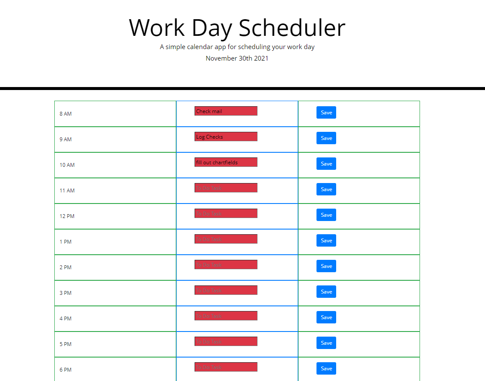

# Work Day Scheduler - Challenge 5

# Description
This project was made to assist users with planning their day. Starting with an 8 AM timeslot and ending with an 8 PM timeslot, the user is able to input a task description into the hour block they desire and save it by pressing the 'save' button. Each hour timeslot is coded to change color depending on the time of day; red if the timeslot has passed, yellow if that timeslot is in the current hour, or green if the timeslot is in the future.

Save functionality relies on localStorage in the browser so the user will not lose any progress they have made if the page refreshes.

# Credits
tutor Sangeetha Kp and numerous Learning Assistants from AskBCS

